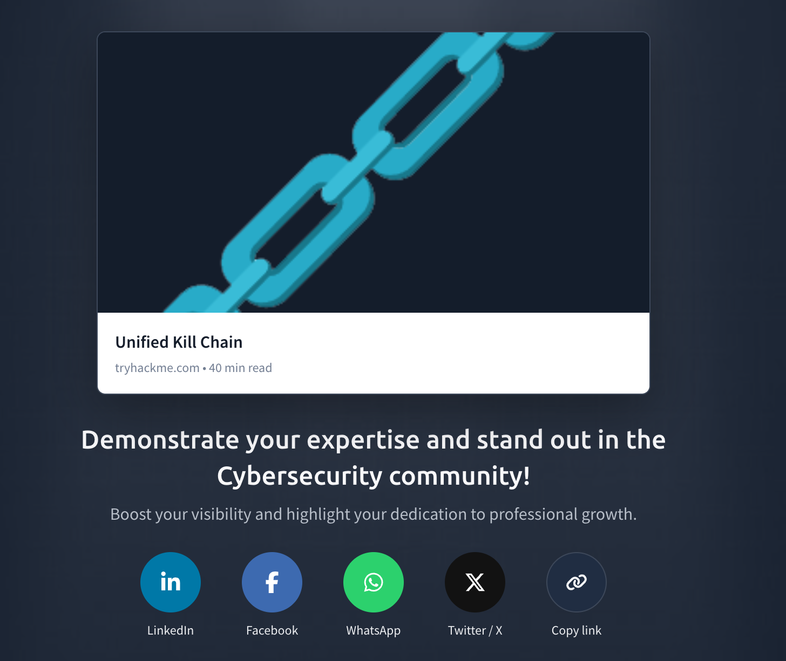

# ⛓️ Unified Kill Chain (UKC)

## 📌 Overview

The **Unified Kill Chain (UKC)** is a cybersecurity framework used to understand how attackers move from planning and gaining access to achieving their final objective.

It provides a structured view of an attacker's journey and helps security professionals understand attacker behaviour, identify potential attack stages, and determine where defensive controls can be applied.

The Unified Kill Chain is divided into three major phases:

- **IN** – Initial Foothold
- **THROUGH** – Network Propagation
- **OUT** – Action on Objectives

## 🖼️ Unified Kill Chain Diagram

---

## 🎯 Objectives

The objectives of this room were to:

- Understand the Unified Kill Chain framework.
- Learn how attackers progress through different stages of an attack.
- Understand the three major phases of the UKC.
- Learn how attackers gain an initial foothold.
- Understand how attackers move through a compromised environment.
- Learn how attackers achieve their final objectives.
- Understand how the framework can help security professionals detect and investigate attacks.

---

## 🧠 Key Concepts

### 1. IN — Initial Foothold

The **IN** phase focuses on how an attacker gets into the target environment.

It represents the activities involved in gaining an initial foothold and establishing access.

The stages covered include:

**Reconnaissance → Weaponization → Social Engineering → Exploitation → Persistence → Defence Evasion → Command & Control → Pivoting**

---

### 2. THROUGH — Network Propagation

The **THROUGH** phase focuses on what an attacker does after gaining access.

The attacker may attempt to understand the environment, obtain additional privileges, execute commands, access credentials, and move to other systems.

The stages covered include:

**Discovery → Privilege Escalation → Execution → Credential Access → Lateral Movement**

---

### 3. OUT — Action on Objectives

The **OUT** phase focuses on the attacker's ultimate objective.

After gaining access and moving through the environment, the attacker may collect information, steal data, or cause damage.

The stages covered include:

**Collection → Exfiltration → Impact**

---

## 🔄 Unified Kill Chain Flow

The overall attack progression can be understood as:

**IN**

Initial Foothold

↓

Reconnaissance

↓

Weaponization

↓

Social Engineering

↓

Exploitation

↓

Persistence

↓

Defence Evasion

↓

Command & Control

↓

Pivoting

↓

**THROUGH**

Network Propagation

↓

Discovery

↓

Privilege Escalation

↓

Execution

↓

Credential Access

↓

Lateral Movement

↓

**OUT**

Action on Objectives

↓

Collection

↓

Exfiltration

↓

Impact

---

## 🔎 Understanding the Attacker's Journey

The Unified Kill Chain helps security professionals understand that an attack is made up of multiple activities rather than one isolated event.

For example, an attacker may:

1. Perform reconnaissance to identify a target.
2. Use social engineering to trick a user.
3. Exploit the target and gain access.
4. Establish persistence.
5. Communicate with an attacker-controlled system.
6. Discover systems and resources within the environment.
7. Escalate privileges.
8. Obtain credentials.
9. Move laterally to another system.
10. Collect sensitive information.
11. Exfiltrate the information.
12. Cause impact or achieve another final objective.

---

## 🛡️ Why the Unified Kill Chain Matters to a SOC Analyst

I learned that the Unified Kill Chain provides a structured way to understand the different activities an attacker may perform during an attack.

As a SOC Analyst, I can use the framework to:

- Understand attacker behaviour.
- Identify the stage an attack may have reached.
- Determine what evidence to investigate.
- Correlate suspicious activities across different systems.
- Identify opportunities to detect and stop an attacker.
- Support incident investigation and response.

For example, if an alert indicates suspicious credential access, understanding the UKC can help me consider what activities may have happened before and what the attacker may attempt to do next.

---

## 📝 What I Learned

I learned about the **Unified Kill Chain (UKC)** and how it can be used to understand an attacker's complete journey.

I learned that the framework is divided into three major phases: **IN, THROUGH, and OUT**.

The **IN** phase focuses on how the attacker gains an initial foothold. The **THROUGH** phase focuses on how the attacker moves through the compromised environment. The **OUT** phase focuses on the actions the attacker takes to achieve their final objective.

I learned that attackers may perform activities such as **reconnaissance, social engineering, exploitation, persistence, defence evasion, command and control, discovery, privilege escalation, credential access, and lateral movement** before reaching their final objective.

I also learned that attackers may eventually perform **collection, exfiltration, and impact** activities depending on what they are trying to accomplish.

Most importantly, I learned that understanding the attacker's journey helps SOC Analysts identify suspicious activities, understand where an attack may be in its progression, and determine where defensive actions can be taken.

---

## 🔑 Key Takeaway

The main takeaway from this room is that the **Unified Kill Chain helps defenders understand the complete attack lifecycle**.

Instead of looking at individual alerts in isolation, a SOC Analyst can use the framework to understand:

**How did the attacker get in? → What did they do after gaining access? → What are they trying to accomplish?**

This makes the Unified Kill Chain useful for **threat detection, investigation, incident response, and understanding attacker behaviour**.
