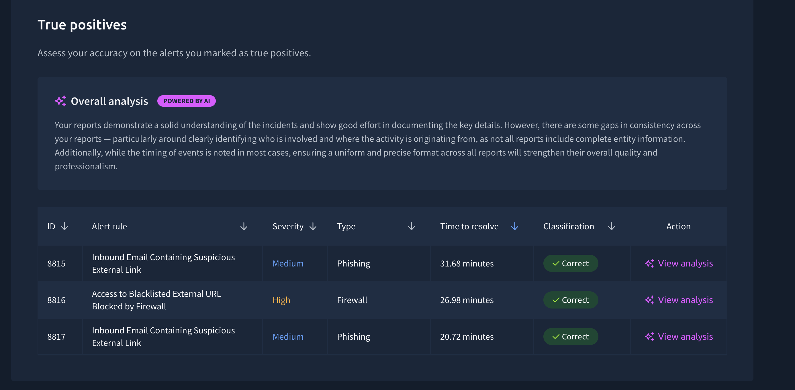
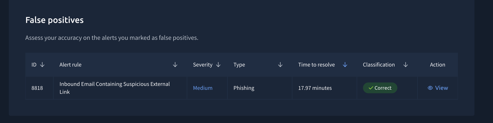
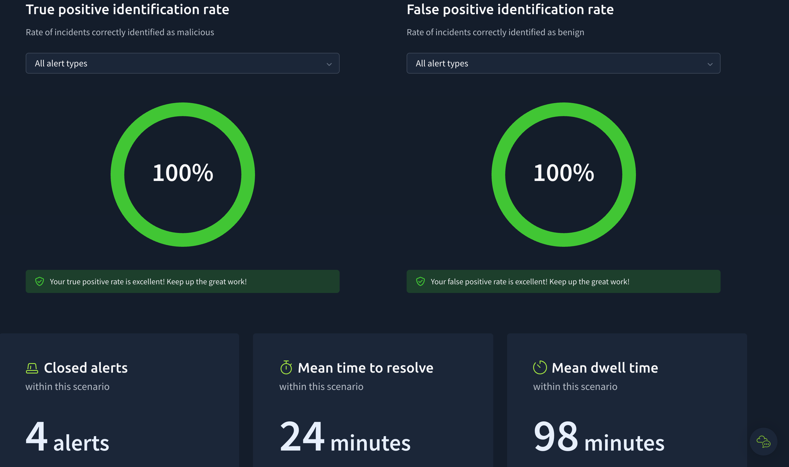
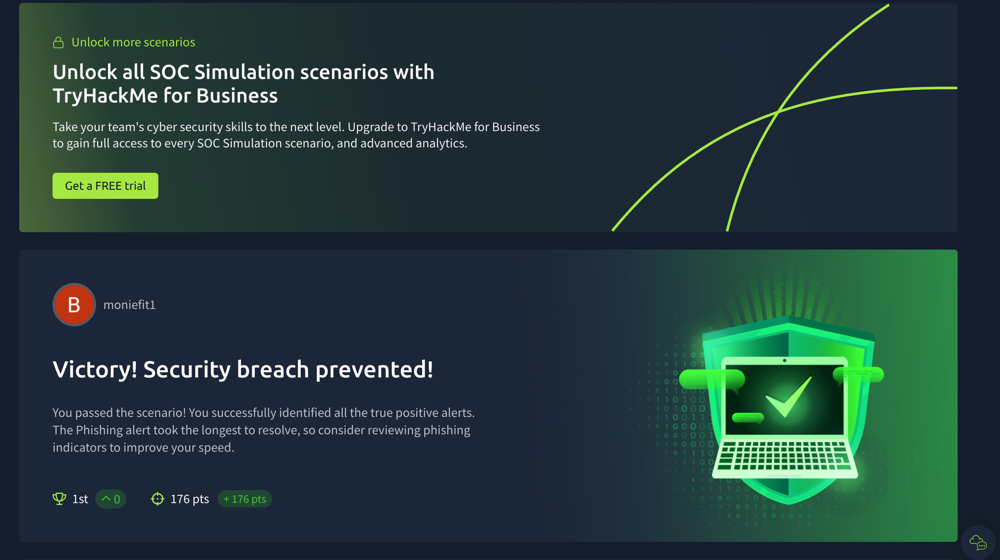

# 🔎 Introduction to Phishing – SOC Simulation

## 📌 Overview

As part of my **Cyber Skills Bridge Internship Program**, I completed the **Introduction to Phishing SOC Simulation** on TryHackMe.

This practical exercise simulated a **Security Operations Center (SOC)** environment where I investigated multiple security alerts and identified genuine phishing and other malicious activity hidden among false-positive alerts.

Using the **TryHackMe SOC Simulator** and **Splunk**, I practiced alert triage, phishing investigation, security event analysis, true-positive and false-positive classification, and incident reporting.

---

## 🎯 Goal of the Task

The goal of this task was to develop practical SOC Analyst skills by investigating security alerts and correctly determining whether each alert represented a genuine security threat or a benign event.

The exercise focused on:

- Security alert triage
- Phishing investigation
- Security event analysis
- Identifying true positives
- Identifying false positives
- Incident investigation
- Incident reporting
- Reducing false-positive noise
- Making accurate security classifications

---

## 🛠️ Tools Used

| Tool | Purpose |
|------|---------|
| **TryHackMe SOC Simulator** | Simulated SOC environment for investigating and responding to security alerts |
| **Splunk** | Security information and event analysis |
| **Web/Email Investigation** | Analysis of phishing-related indicators and suspicious activity |

---

## 🔍 Investigation Process

The investigation involved reviewing a number of security alerts presented within the SOC simulation.

For each alert, I:

1. Reviewed the alert details and severity.
2. Examined the alert type and available security information.
3. Investigated the activity using the available SOC simulation data and Splunk.
4. Determined whether the alert represented malicious or benign activity.
5. Classified the alert as either a **True Positive** or **False Positive**.
6. Documented the investigation and resolution.
7. Repeated the process until all relevant alerts were investigated.

The main challenge was identifying the genuine threats while filtering out benign activity and avoiding unnecessary escalation.

---

## 🚨 True Positive Identification

I successfully identified all the alerts that represented genuine malicious activity.

The confirmed true-positive alerts included:

| Alert ID | Alert Rule | Severity | Type | Classification |
|---------:|------------|----------|------|----------------|
| **8815** | Inbound Email Containing Suspicious External Link | Medium | Phishing | Correct |
| **8816** | Access to Blacklisted External URL Blocked by Firewall | High | Firewall | Correct |
| **8817** | Inbound Email Containing Suspicious External Link | Medium | Phishing | Correct |

These alerts contained indicators consistent with malicious or suspicious activity and were correctly classified during the investigation.

### 📸 True Positive Results

---

## ⚠️ False Positive Identification

During the simulation, I also identified a benign alert that initially appeared suspicious.

| Alert ID | Alert Rule | Severity | Type | Classification |
|---------:|------------|----------|------|----------------|
| **8818** | Inbound Email Containing Suspicious External Link | Medium | Phishing | Correctly classified as False Positive |

This demonstrated the importance of investigating the available evidence before escalating an alert. Not every suspicious-looking alert represents a confirmed security incident.

### 📸 False Positive Results

---

## 📝 Incident Reporting

As part of the investigation, I practiced documenting security incidents and recording important details about the alerts.

The reporting process involved identifying relevant information such as:

- Alert type
- Alert severity
- Classification
- Indicators associated with the activity
- Investigation findings
- Time taken to resolve the alert
- Final disposition of the alert

This helped reinforce the importance of clear and consistent documentation in a SOC environment.

---

## 📊 Performance Metrics

The completed simulation produced the following results:

| Metric | Result |
|--------|--------|
| **True Positive Identification Rate** | 100% |
| **False Positive Identification Rate** | 100% |
| **Closed Alerts** | 4 |
| **Mean Time to Resolve (MTTR)** | 24 minutes |
| **Mean Dwell Time** | 98 minutes |
| **Final Score** | 176 points |

The simulation feedback indicated that all true-positive alerts were successfully identified and the false-positive alert was also correctly classified.

### 📸 Performance Metrics

---

## 🏆 Scenario Completion

I successfully completed the SOC simulation and correctly identified all true-positive alerts as well as the false-positive alert.

The simulation provided practical experience in working through a SOC alert queue and making classification decisions based on available evidence.

### 📸 Completion Screenshot

---

## 💡 Key Findings

The exercise demonstrated several important aspects of SOC operations:

- Phishing alerts require careful investigation rather than immediate escalation.
- Suspicious external links can be important indicators of phishing activity.
- Firewall alerts can provide useful evidence when malicious URLs are blocked.
- Security analysts must distinguish between genuine threats and false positives.
- Accurate incident classification is important for effective SOC operations.
- Proper documentation makes security investigations easier to understand and review.
- Speed is important during alert triage, but accuracy must not be sacrificed.

---

## 📚 What I Learned

This simulation helped me understand how SOC Analysts investigate and respond to security alerts in a practical environment.

I learned how to:

- Perform basic alert triage.
- Investigate phishing-related alerts.
- Analyze security events using Splunk.
- Identify indicators of potentially malicious activity.
- Differentiate true positives from false positives.
- Document investigation findings.
- Prioritize alerts based on severity and available evidence.
- Understand the importance of Mean Time to Resolve (MTTR).
- Improve my approach to phishing investigations.

One important lesson from the simulation was that **not every security alert is a confirmed threat**. A SOC Analyst must investigate the available evidence, validate the activity, and make an informed classification before taking further action.

---

## 🎓 SOC Analyst Skills Practiced

This lab strengthened my practical experience in:

- 🔎 Alert Triage
- 🎣 Phishing Analysis
- 📊 Log Analysis
- 🛡️ Security Monitoring
- 🚨 Incident Investigation
- ✅ True Positive Identification
- ⚠️ False Positive Identification
- 📝 Incident Reporting
- ⏱️ Alert Resolution
- 🔍 Security Event Analysis

---

## 📌 Conclusion

The **Introduction to Phishing SOC Simulation** provided hands-on experience with a simulated Security Operations Center workflow.

By investigating four alerts, correctly identifying the malicious activity, classifying the false positive, and documenting the findings, I strengthened my understanding of practical SOC Analyst responsibilities.

This exercise also reinforced the importance of **accuracy, evidence-based investigation, effective documentation, and timely alert resolution** in security operations.

---

## 🔗 Lab Platform

**TryHackMe:** Introduction to Phishing / SOC Simulation

> This write-up documents my practical learning experience and investigation process from the SOC simulation completed as part of my Cyber Skills Bridge Internship Program.
