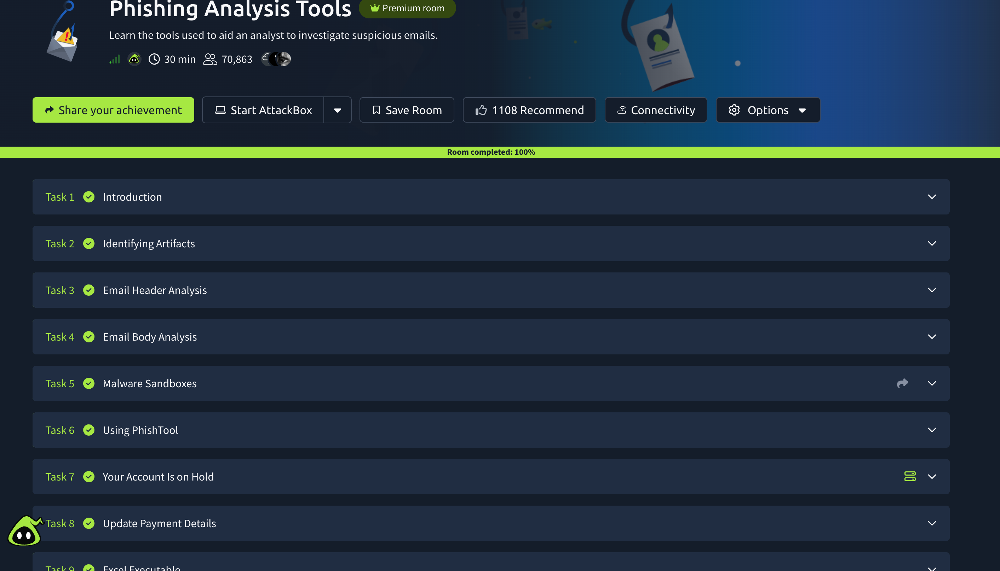

# 🛠️ Phishing Analysis Tools

## 📌 Overview

This TryHackMe room introduced tools and techniques used by security
analysts to investigate suspicious emails and phishing attempts.

## 🎯 Objectives

- Understand phishing analysis tools
- Identify important email artifacts
- Analyze suspicious URLs and attachments
- Understand malware sandboxing
- Learn how phishing investigation tools support SOC analysts

## 🧠 What I Learned

I learned how security analysts can use specialized tools to investigate
suspicious emails, URLs, attachments, and other artifacts.

I also learned the importance of extracting useful Indicators of
Compromise (IOCs) during an investigation.

### Key areas covered

- Email analysis
- Email headers
- URL investigation
- Attachment analysis
- Malware sandboxing
- IOC identification
- Phishing investigation

## 🔐 SOC Analyst Relevance

Phishing analysis tools can help SOC analysts determine whether a
suspicious email is malicious and provide evidence for further
investigation and incident response.

## 🛠️ Platform

- TryHackMe

## 💡 Key Takeaway

Effective phishing investigation requires combining multiple pieces
of evidence rather than relying on a single indicator.

## 📸 Room Completion

## ✅ Status

**Completed — 100%**
