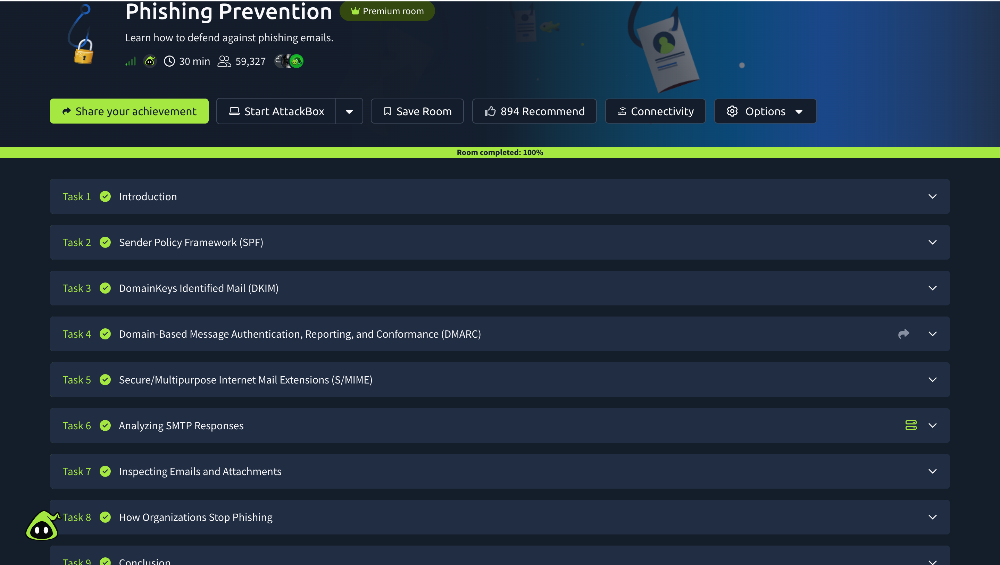

# 🛡️ Phishing Prevention

## 📌 Overview

This TryHackMe room focused on the techniques and security controls
organizations can use to prevent, detect, and reduce the impact of
phishing attacks.

The room introduced email authentication mechanisms and techniques
used to improve email security.

## 🎯 Objectives

- Understand email authentication
- Learn how SPF works
- Understand DKIM
- Understand DMARC
- Learn about S/MIME
- Analyze SMTP responses
- Inspect suspicious emails and attachments
- Understand organizational phishing prevention

## 🧠 What I Learned

I learned that organizations can use multiple layers of email security
to reduce phishing and email spoofing attacks.

### SPF — Sender Policy Framework

SPF allows a domain owner to specify which mail servers are authorized
to send emails on behalf of that domain.

### DKIM — DomainKeys Identified Mail

DKIM uses cryptographic signatures to help verify that an email was
authorized by the sending domain and that important parts of the
message have not been modified.

### DMARC — Domain-based Message Authentication, Reporting and
Conformance

DMARC builds on SPF and DKIM to help domain owners define how receiving
mail servers should handle messages that fail authentication checks.

### S/MIME

S/MIME provides mechanisms for email encryption and digital signatures,
helping provide confidentiality, integrity, authentication, and
non-repudiation.

## 🔎 Email Investigation

I also learned how security analysts can inspect SMTP responses,
email headers, email content, links, and attachments when investigating
potentially malicious messages.

Important areas to investigate include:

- Sender information
- Authentication results
- Email headers
- URLs
- Attachments
- SMTP responses
- Suspicious domains
- Indicators of compromise

## 🏢 How Organizations Stop Phishing

Organizations can reduce phishing risk through a combination of:

- SPF, DKIM, and DMARC
- Email security gateways
- Spam filtering
- URL and attachment scanning
- Security awareness training
- Multi-factor authentication (MFA)
- Endpoint protection
- Incident response procedures

## 🔐 SOC Analyst Relevance

Phishing prevention is highly relevant to SOC operations.

SOC analysts may investigate suspicious emails, review authentication
results and headers, identify malicious links or attachments, extract
IOCs, and escalate confirmed phishing incidents for response.

## 🛠️ Platform

- TryHackMe

## 📚 Skills Practiced

- Email Security
- Phishing Prevention
- Email Authentication
- SPF
- DKIM
- DMARC
- S/MIME
- Email Header Analysis
- IOC Identification
- Incident Response

## 💡 Key Takeaway

Effective phishing defense requires multiple layers of protection.
Email authentication technologies such as SPF, DKIM, and DMARC help
organizations reduce spoofing, while security awareness, monitoring,
and incident response help address phishing attempts that bypass
preventive controls.

## 📸 Room Completion

## ✅ Status

**Completed — 100%**
